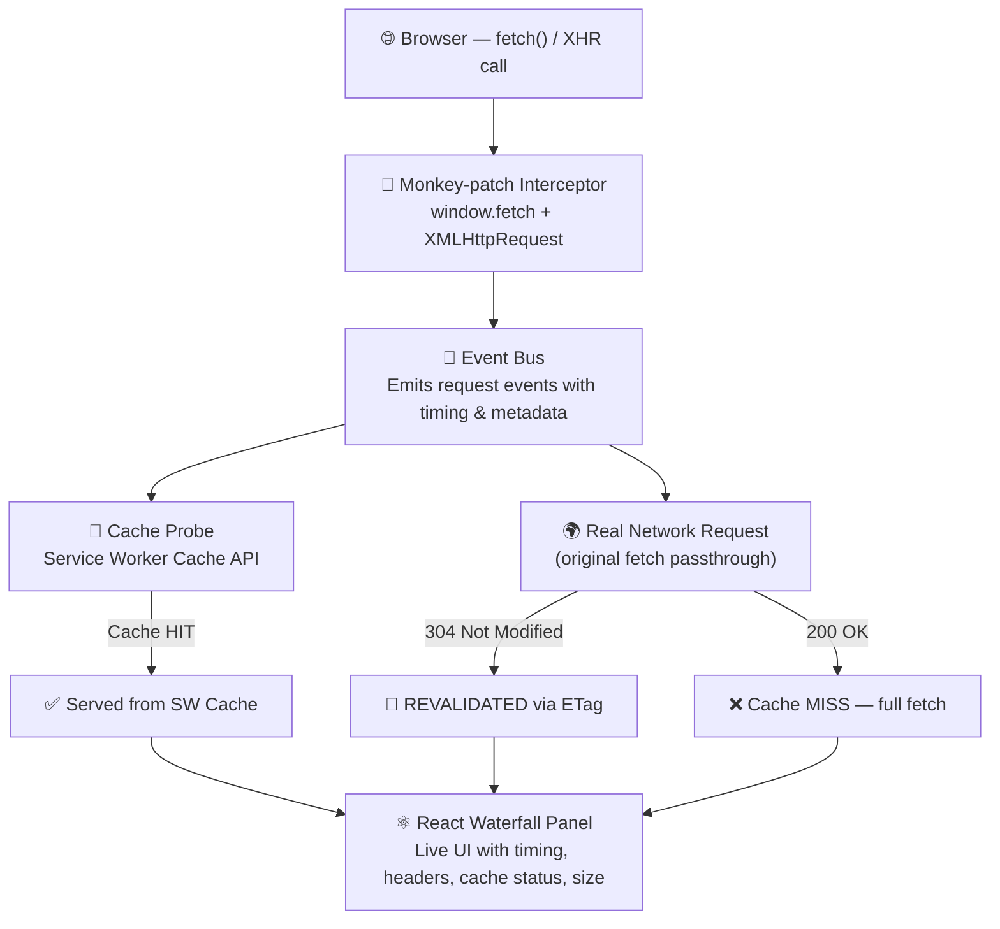

# Network Request Visualiser

> A browser tool that intercepts every `fetch` and `XHR` call on the page and renders a **live waterfall timeline** — like a mini DevTools Network tab you built yourself.

---

## Table of Contents

- [What It Does](#what-it-does)
- [Architecture](#architecture)
- [How It Works](#how-it-works)
  - [1. Intercepting Requests](#1-intercepting-requests)
  - [2. Cache Status Detection](#2-cache-status-detection)
  - [3. In-Memory LRU Cache](#3-in-memory-lru-cache-dsa-connection-)
- [Key Caching Concepts](#key-caching-concepts)
- [Tech Stack](#tech-stack)
- [Getting Started](#getting-started)
- [Project Structure](#project-structure)
- [Resources](#resources)

---

## What It Does

This project wraps around the browser's native `fetch` and `XMLHttpRequest`, intercepts every outgoing network request, and renders a floating live panel showing:

- ⏱️ **Request timing** — waterfall bars showing start time and duration
- 📋 **Headers** — request/response headers at a glance
- 💾 **Cache status** — HIT / MISS / REVALIDATED, detected via the Service Worker Cache API
- 📦 **Response size** — bytes received per request
- 🏷️ **ETag tracking** — see when the browser revalidates with `304 Not Modified`

---

## Architecture



---

## How It Works

### 1. Intercepting Requests

The global `fetch` is wrapped before any other code runs. The original is stored, replaced with a proxy that records timing, then calls through. The same is done for `XMLHttpRequest.prototype.open` and `send`.

```ts
const _fetch = window.fetch;
window.fetch = async (url, opts) => {
  const start = performance.now();
  const res = await _fetch(url, opts);
  const duration = performance.now() - start;

  emit({
    url,
    status: res.status,
    duration,
    cacheStatus: res.headers.get('x-cache') || 'UNKNOWN',
    etag: res.headers.get('etag'),
  });

  return res;
};
```

### 2. Cache Status Detection

The **Service Worker Cache API** is used to determine how a response was served:

| Status | How it's detected |
|---|---|
| `HIT` | `caches.match(request)` returns a result before the network responds |
| `REVALIDATED` | Response status is `304 Not Modified` (ETag matched) |
| `MISS` | Neither of the above — full network fetch |

### 3. In-Memory LRU Cache (DSA Connection 💡)

Request metadata is stored in memory using an **LRU Cache** — the same structure as [LeetCode 146](https://leetcode.com/problems/lru-cache/):

- A **HashMap** gives O(1) lookup by URL
- A **doubly-linked list** gives O(1) eviction of the least-recently-used entry

> The browser's HTTP cache **is** an LRU cache with a TTL overlay. This project makes that connection concrete.

---

## Key Caching Concepts

### `Cache-Control` Headers
```
Cache-Control: max-age=3600              → cache for 1 hour
Cache-Control: stale-while-revalidate=60 → serve stale, refresh in background
Cache-Control: no-cache                  → always revalidate with the server
```

### ETag Flow
```
Client → GET /api/data
Server → 200 OK, ETag: "abc123"

Client → GET /api/data, If-None-Match: "abc123"
Server → 304 Not Modified   ← no body sent, saves bandwidth
```


---

## Tech Stack

- **[Next.js 16](https://nextjs.org)** — App Router
- **React 19** — Floating panel UI
- **TypeScript** — Fully typed
- **Tailwind CSS** — Styling
- **Service Worker Cache API** — Cache status probing

---

## Getting Started

```bash
# Install dependencies
pnpm install

# Start the development server
pnpm dev
```

Open [http://localhost:3000](http://localhost:3000) to see the visualiser in action.

---

## Project Structure

```
app/
├── components/       # React UI components (waterfall panel, request rows)
├── api/              # Next.js API routes (test endpoints to trigger requests)
├── layout.tsx        # Root layout
├── page.tsx          # Home page
└── globals.css       # Global styles
lib/
└──                   # Utility functions (LRU cache, event bus, interceptors)
```

---

## Resources

- [Fetch API — MDN](https://developer.mozilla.org/en-US/docs/Web/API/Fetch_API)
- [Cache API — MDN](https://developer.mozilla.org/en-US/docs/Web/API/Cache)
- [HTTP Caching — MDN](https://developer.mozilla.org/en-US/docs/Web/HTTP/Caching)
- [LRU Cache — LeetCode 146](https://leetcode.com/problems/lru-cache/)
- [Next.js Docs](https://nextjs.org/docs)
